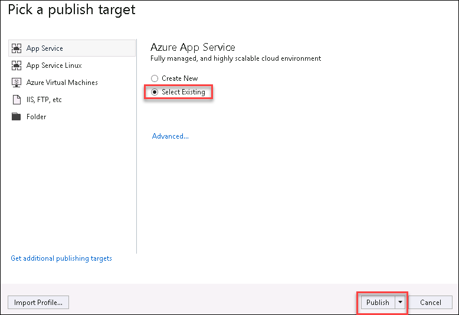

## Exercise 5: Update the web application to use the new SQL MI database

Duration: 30 minutes

With the `TailspinToys` database now running on SQL MI in Azure, the next step is to make the required modifications to the TailspinToys gamer information web application.

>**Note**: SQL Managed Instance has a private IP address in a dedicated VNet, so to connect an application, you must configure access to the VNet where Managed Instance is deployed. 

### Task 1: Deploy the web app to Azure

In this task, you are using the JumpBox VM and then using Visual Studio on the JumpBox, deploy the `TailspinToysWeb` application into the App Service in Azure.

1. Go to your Lab Environment details page and click on the **Go TO JUMPBOX-SUFFIX** button to launch the VM.

  
  
2. Once VM launched, open File Explorer by selecting it in the Windows start bar.

   

3. In the File Explorer dialog, navigate to the ```C:\hands-on-lab``` folder and then drill down to ```Migrating-SQL-databases-to-Azure-master\Hands-on lab\lab-files```. In the `lab-files` folder, double-click `TailspinToysWeb.sln` to open the solution in Visual Studio.

    

10. If prompted about how you want to open the file, select **Visual Studio 2019** and then select **OK**.

    

11. Select **Sign in** and enter your Azure account credentials from below.
    
    * Azure Usename/Email: <inject key="AzureAdUserEmail"></inject>
    * Azure Password: <inject key="AzureAdUserPassword"></inject>

    


13. Once logged into Visual Studio, right-click the `TailspinToysWeb` project in the Solution Explorer, and then select **Publish**.

    
    
2. Select **Select Existing** and click on Publish button.

    
  
3. Select **tailspintoysSUFFIX** app service under hands-on-lab-SUFFIX Resource group and click on ok button.
  
    
   

17. Select **Publish** to start the process of publishing the application to Azure.

    

18. When the publish completes, you will see a message in the Visual Studio Output page that the publish succeeded.

    

19. If you select the link of the published web app from the Visual Studio output window, an error page is returned because the database connection strings have not been updated to point to the SQL MI database. You address this in the next task.

    
