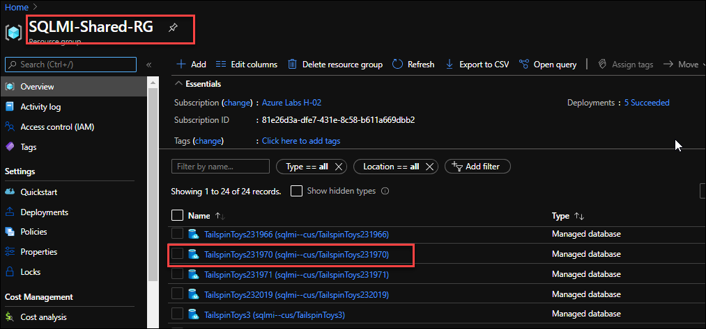
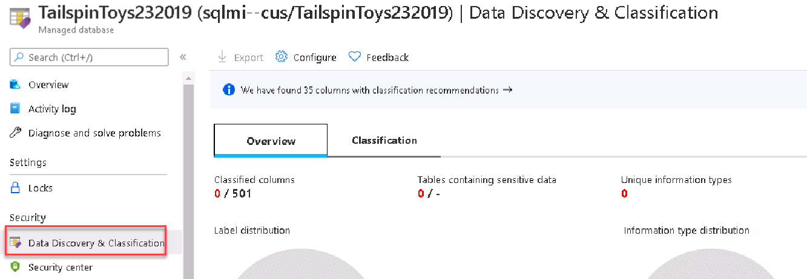
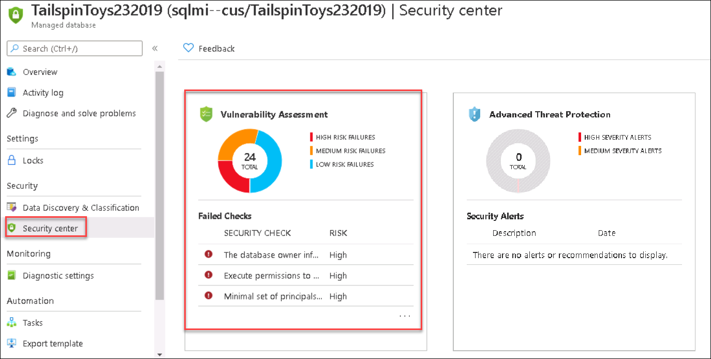

## Exercise 5: Improve database security posture with Advanced Data Security

Duration: 30 minutes

In this exercise, you enable Advanced Data Security (ADS) on your SQL MI database and explore some of the security benefits that come with running your database in Azure. SQL Database Advance Data Security (ADS) provides advanced SQL security capabilities, including functionality for discovering and classifying sensitive data, surfacing and mitigating potential database vulnerabilities, and detecting anomalous activities that could indicate a threat to your database.

### Task 1: Configure SQL Data Discovery and Classification

In this task, you will look at the [SQL Data Discovery and Classification](https://docs.microsoft.com/sql/relational-databases/security/sql-data-discovery-and-classification?view=sql-server-2017) feature of Advanced Data Security. Data Discovery & Classification introduces a new tool for discovering, classifying, labeling & reporting the sensitive data in your databases. It introduces a set of advanced services, forming a new SQL Information Protection paradigm aimed at protecting the data in your database, not just the database. Discovering and classifying your most sensitive data (business, financial, healthcare, etc.) can play a pivotal role in your organizational information protection stature.

>**Note**: This functionality is currently available *in Preview* for SQL MI through the Azure portal.
1. In the [Azure portal](https://portal.azure.com), select **Resource groups** from the Azure services list.

    

2. Select the SQLMI-Shared-RG resource group from the list. 
  
    

3. Select the **TailspinToysSUFFIX** Managed database resource from the list.

    

4. On the TailspinToysSUFIX Managed database blade, select Data Discovery and Classification from the left-hand menu, under Security.

    

5. In the **Data Discovery & Classification** blade, select the info link with the message **We have found 35 columns with classification recommendations**.

    

6. Look over the list of recommendations to get a better understanding of the types of data and classifications are assigned, based on the built-in classification settings. In the list of classification recommendations, select the recommendation for the **Sales - CreditCard - CardNumber** field.

    

4. Due to the risk of exposing credit card information, Tailspin Toys would like a way to classify it as highly confidential, not just **Confidential**, as the recommendation suggests. To correct this, select **+ Add classification** at the top of the Data Discovery & Classification blade.

    

5. Quickly expand the **Sensitivity label** field, and review the various built-in labels you can choose from. You can also add your own labels, should you desire.

    

6. In the Add classification dialog, enter the following:

    - **Schema name**: Select Sales.
    - **Table name**: Select CreditCard.
    - **Column name**: Select CardNumber (nvarchar).
    - **Information type**: Select Credit Card.
    - **Sensitivity level**: Select Highly Confidential.

    

7. Select **Add classification**.

8. You will see the **Sales - CreditCard - CardNumber** field disappear from the recommendations list, and the number of recommendations drop by 1.

9. Other recommendations you can review are the **HumanResources - Employee** fields for **NationIDNumber** and **BirthDate**. Note that these have been flagged by the recommendation service as **Confidential - GDPR**. As Tailspin Toys maintains data about gamers from around the world, including Europe, having a tool which helps them discover data which may be relevant to GDPR compliance will be very helpful.

    

10. Check the **Select all** check box at the top of the list to select all the remaining recommended classifications, and then select **Accept selected recommendations**.

    

11. Select **Save** on the toolbar of the Data Classification window. It may take several minutes for the save to complete.

    
    
    >**Note**: This feature is still in preview.  If you receive an error when saving, try returning to the Advanced Data Security blade, and selecting the Data Discovery & Classification tile again to see the results.

12. When the save completes, select the **Overview** tab on the Data Discovery & Classification blade to view a report with a full summary of the database classification state.

    


### Task 2: Review an Advanced Data Security Vulnerability Assessment

In this task, you review an assessment report generated by ADS for the `TailspinToys` database and take action to remediate one of the findings in the `TailspinToys` database. The SQL Vulnerability Assessment service is a service that provides visibility into your security state and includes actionable steps to resolve security issues and enhance your database security.

1. Return to the Security center blade for the TailspinToysSUFFIX Managed database and then select the Vulnerability Assessment tile."

    

2. On the Vulnerability Assessment blade, select **Scan** on the toolbar.

    

3. When the scan completes, a dashboard displaying the number of failing and passing checks, along with a breakdown of the risk summary by severity level is displayed.

    

4. In the scan results, take a few minutes to browse both the Failed and Passed checks, and review the types of checks that are performed. In the **Failed** the list, locate the security check for **Transparent data encryption**. This check has an ID of **VA1219**.

    

5. Select the **VA1219** finding to view the detailed description.

    

    > The details for each finding provide more insight into the reason for the finding. Of note are fields describing the finding, the impact of the recommended settings, and details on remediation for the finding.

6. You will now act on the recommended remediation steps for the finding and enable Transparent Data Encryption for the `TailspinToys` database. To accomplish this, switch over to using SSMS on your JumpBox-SUFFIX VM for the next few steps.

    >**Note**: Transparent data encryption (TDE) needs to be manually enabled for Azure SQL Managed Instance. TDE helps protect Azure SQL Database, Azure SQL Managed Instance, and Azure Data Warehouse against the threat of malicious activity. It performs real-time encryption and decryption of the database, associated backups, and transaction log files at rest without requiring changes to the application.

7. On your JumpBox-SUFFIX VM, open Microsoft SQL Server Management Studio 18 from the Start menu, and enter the following information in the **Connect to Server** dialog.

    - **Server name**: Enter the fully qualified domain name of your SQL managed instance, which you copied from the Azure Cloud Shell in a previous task.
    - **Authentication**: Select **SQL Server Authentication**.
    - **Login**: Enter ```contosoadmin```
    - **Password**: Enter ```IAE5fAijit0w^rDM```
    - Check the **Remember password** box.

    

8. In SSMS, select **New Query** from the toolbar, paste the following SQL script into the new query window. Make sure to replace SUFFIX Value.

    ```sql
    USE TailspinToysSUFFIX;
    GO

    ALTER DATABASE [TailspinToysSUFFIX] SET ENCRYPTION ON
    ```

    > You turn transparent data encryption on and off on the database level. To enable transparent data encryption on a database in Azure SQL Managed Instance use must use T-SQL.

9. Select **Execute** from the SSMS toolbar. After a few seconds, you will see a message that the "Commands completed successfully."

10. You can verify the encryption state and view information the associated encryption keys by using the sys.dm_database_encryption_keys view. Select **New Query** on the SSMS toolbar again, and paste the following query into the new query window:

    ```sql
    SELECT * FROM sys.dm_database_encryption_keys
    ```

    

11. Select **Execute** from the SSMS toolbar. You will see two records in the Results window, which provide information about the encryption state and keys used for encryption.

    

    > By default, service-managed transparent data encryption is used. A transparent data encryption certificate is automatically generated for the server that contains the database.

12. Return to the Azure portal and the Advanced Data Security - Vulnerability Assessment blade of the `TailspinToys` managed database. On the toolbar, select **Scan** to start a new assessment of the database.

    

13. When the scan completes, select the **Failed** tab, enter **VA1219** into the search filter box, and observe that the previous failure is no longer in the Failed list.

    

14. Now, select the **Passed** tab, and observe the **VA1219** check is listed with a status of **PASS**.

    

    > Using the SQL Vulnerability Assessment, it is simple to identify and remediate potential database vulnerabilities, allowing you to improve your database security proactively.
